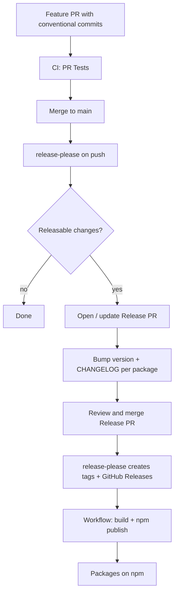
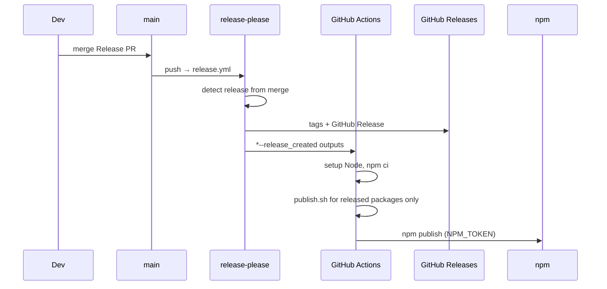

# Release

Releases are driven by **[release-please](https://github.com/googleapis/release-please)** (workflow `.github/workflows/release.yml`).

- Trigger: push to `main`
- Versions: independent per package
- Bump source: Conventional Commits + file paths
- Publish: only packages that got a new release

Config files: `.release-please-config.json` and `.release-please-manifest.json` (last released versions).

---

## Full flow



### After the Release PR is merged



Each package has `publish.sh` → `build.sh` → `npm publish` from `dist/`.

---

## One package (CLI only)

1. Change files only under `packages/cli/**`.
2. Commit with `feat(cli): ...` or `fix(cli): ...`.
3. Merge the feature PR → Release PR bumps only `@lang-tag/cli`.
4. Merge the Release PR → tag + publish CLI only.

---

## Two packages at once (CLI + presets)

No extra command. You need releasable commits (since the last release) that touch both trees.

**Example — one feature PR:**

```text
packages/cli/src/...        ← changed
packages/presets/src/...    ← changed

feat(cli): use new preset resolver
feat(presets): add resolver helper
```

After merge to `main`, release-please builds **one** Release PR:

- `@lang-tag/cli` → e.g. minor
- `@lang-tag/presets` → e.g. minor
- `lang-tag` (core) → unchanged

After you merge that Release PR, the workflow publishes **both** (separate tags, because `monorepo-tags: true`).

**Example — two feature PRs before merging the Release PR:**

1. Merge `fix(cli): ...` → Release PR updates for CLI.
2. Merge `feat(presets): ...` → same Release PR also gets presets.
3. One Release PR merge ships both.

Until the Release PR is merged, more pushes to `main` only update that PR.

---

## How the bump is chosen

| Commit                                                  | Effect |
| ------------------------------------------------------- | ------ |
| `fix:` / `fix(scope):`                                  | patch  |
| `feat:` / `feat(scope):`                                | minor  |
| `BREAKING CHANGE` in body/footer, or `!` after the type | major  |

Package mapping by path:

- `packages/core` → `lang-tag`
- `packages/cli` → `@lang-tag/cli`
- `packages/presets` → `@lang-tag/presets`

---

## Repo files

| File                             | Role                                                     |
| -------------------------------- | -------------------------------------------------------- |
| `.release-please-config.json`    | package list, npm names, changelog paths                 |
| `.release-please-manifest.json`  | last **released** versions (source of truth for the bot) |
| `packages/*/CHANGELOG.md`        | created / updated in the Release PR                      |
| `.github/workflows/release.yml`  | release-please + conditional publish                     |
| `.github/workflows/pr-tests.yml` | tests on PR / push                                       |

After a good release, the manifest and each `package.json` `version` should match. Bumping versions by hand (or publishing locally) breaks that — see [fix-version-drift.md](TEST/fix-version-drift.md).

---

## Do not

- Push straight to `main`.
- Run `npm publish` locally in the normal flow.
- Bump `package.json` versions “ahead of time”.
- Expect npm publish from a feature PR alone — you need the Release PR first.
